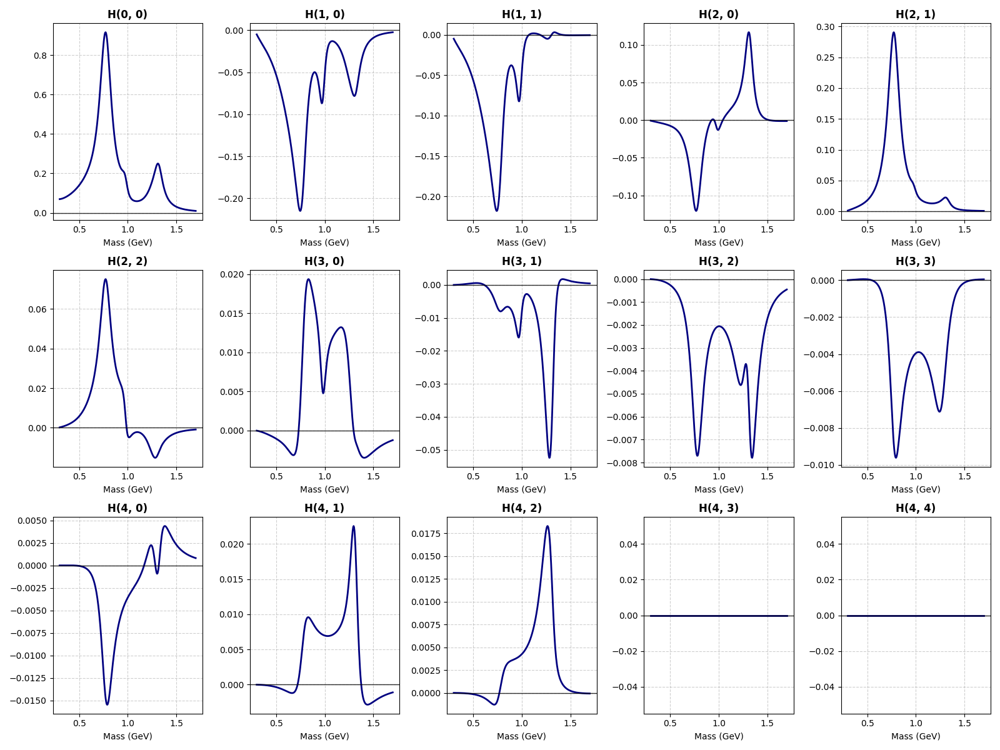

# mesons2moments

**mesons2moments** is a lightweight, strictly coherent Partial Wave Analysis (PWA) engine written in Python. It simulates the coherent interference of meson partial waves to generate physical spherical harmonic moments $H(L, M)$ and polarized beam asymmetries $H^\alpha(L, M)$.

Designed specifically for photoproduction analyses (like those at CLAS or GlueX), the engine strictly enforces angular momentum addition rules via Clebsch-Gordan coefficients, operates in the reflectivity basis, and automatically queries the Particle Data Group (PDG) database to construct exact relativistic Breit-Wigner shapes.



## Features
* **Full Coherence:** Handles complex interference between S, P, D, and F waves, automatically mapping out mass-dependent phase dynamics (e.g., resonance dips and zero-crossings).
* **Polarized Observables:** Generates unpolarized moments ($\alpha=0$) as well as linear and circular polarized observables ($\alpha=1, 2, 3$) using the Mathieu reflectivity prescription.
* **Smart PDG Lookup:** Uses `scikit-hep/particle` to fetch exact masses and widths. Automatically rescues users from string-matching errors by dumping valid meson tables to the terminal.
* **Auto-Renormalization:** Input relative wave fractions, and the engine dynamically renormalizes the production amplitudes to conserve total yield.
* **Data Export & Visualization:** Automatically handles plotting kinematic arrays and exporting data to clean, analysis-ready CSV files.


## Installation

It is recommended to run this in a Python virtual environment. 

1. **Clone the repository:**
   ```bash
   git clone [https://github.com/dglazier/mesons2moments.git](https://github.com/dglazier/mesons2moments.git)
   cd mesons2moments
   ```

2. **Install the required dependencies:**
   The physics and data engines require a few standard scientific Python libraries, and the web apps require Streamlit:
   ```bash
   pip install numpy scipy pandas matplotlib particle streamlit
   ```

## File Structure
* **`amplitude_model.py`**: The primary orchestrator. Handles wave normalization, phase application, and double-loop bilinear summation to generate $H^\alpha(L,M)$.
* **`partial_wave.py`**: Represents an individual quantum state $|l, m\rangle$. Queries the PDG for masses/widths and manages quantum numbers.
* **`physics_engine.py`**: Calculates the dynamical mass shapes (Relativistic Breit-Wigner, Blatt-Weisskopf barrier factors, breakup momenta).
* **`cg_engine.py`**: The Clebsch-Gordan calculator enforcing parity and angular momentum selection rules for $\langle l_1, m_1; l_2, m_2 | L, M \rangle$.
* **`io_utils.py` / `plot_utils.py`**: Helpers for exporting $H(L,M)$ dictionaries to pandas DataFrames/CSVs and paginating Matplotlib visualizations.
* **`develop.py`**: A robust unit-testing suite to verify all physics outputs and geometry factors are working properly.
* **`pwa_generator.py` & `pwa_particle_game.py`**: Interactive Streamlit web interfaces for the engine.

## Usage 

### 1. Unpolarized Photoproduction (Basic Example)
To build a basic model and visualize the unpolarized moments $H^0(L, M)$, run the included `example_pipi.py` script.

```bash
python3 example_pipi.py
```

**Snippet from `example_pipi.py`:**
```python
from amplitude_model import AmplitudeModel
import plot_utils
import io_utils

# Initialize the kinematic window
model = AmplitudeModel(Mx_min=0.3, Mx_max=1.7, num_bins=300)

# Add Partial Waves (S-wave background and f0(980) dip)
model.add_wave(9000221, l=0, m=0, epsilon=1, fraction=0.50, phase=0.0)    # f0(500)
model.add_wave(9000211, l=0, m=0, epsilon=1, fraction=0.15, phase=3.14)   # f0(980)

# Generate moments up to L=4
moments = model.generate_moments(L_max=4, include_zeros=True)

# Export to CSV and Plot
df = io_utils.moments_to_dataframe(model.Mx, moments)
io_utils.export_to_csv(df, "pipi_model_moments.csv")
plot_utils.plot_moments(model.Mx, moments, title_prefix="Unpolarized pi+ pi-")
plot_utils.show_all_plots()
```

### 2. Polarized Observables
To generate the full suite of polarized observables ($H^0, H^1, H^2, H^3$), you must include waves from both natural ($\epsilon=+1$) and unnatural ($\epsilon=-1$) parity exchanges. Run the polarized script:

```bash
python3 example_polarized.py
```

This loops through the Mathieu alpha states and outputs four separate CSV files, alongside a background-rendered visualization grid for each observable. 

## Defining Waves
Waves are defined using `model.add_wave(particle, l, m, epsilon, fraction, phase)`.
* **`particle`**: Can be a string (e.g., `"rho(770)"`), an exact integer PDG ID (e.g., `113`), or a custom dictionary (e.g., `{'mass': 1.2, 'width': 0.4}`). Integer IDs are the most robust against naming convention changes.
* **`l`, `m`**: Intrinsic partial wave spin and z-projection.
* **`epsilon`**: Reflectivity eigenvalue ($\pm 1$).
* **`fraction`**: Approximate total intensity contribution of this wave. If the total fractions exceed `1.0`, they are proportionally scaled down.
* **`phase`**: Relative complex phase in radians. Adjusting these by $\pi$ flips the sign of interference cross-terms (e.g., reversing the structure of an $S-P$ interference moment).

## Interactive Web Apps (Streamlit)

Alongside the core physics engine, this repository includes two interactive, browser-based applications designed to build intuition for partial wave interference without writing code.

* **[PWA Intensity Generator](Generator.md)** (`pwa_generator.py`): An introductory sandbox designed for teaching. Users can select mesons from a visual PDG roster, adjust their kinematic limits, and immediately visualize how the quantum mechanical probability waves overlap and interfere to create the angular fingerprints observed in detectors. Note: Ensure local image assets (`collision_schematic.jpg`, `harmonics.png`) are in the same directory for the primer page to render correctly.
* **[PWA Particle Game](ParticleGameOverview.md)** (`pwa_particle_game.py`): A gamified, graduate-level training tool. The engine secretly generates a target intensity distribution ("Truth") using the JPAC photoproduction formalism. Users must act as the fitter—manually reconstructing the cross-section by selecting the correct interfering resonances, reflectivities, and phases to minimize the $\chi^2$ and discover the underlying states.

To launch either of the web applications, use Streamlit from your terminal:
```bash
streamlit run pwa_generator.py
# or
streamlit run pwa_particle_game.py
```

## Notes on Mathematics
The moment summation strictly enforces $\Delta m$ selection rules and evaluates the combinations:
* $\alpha = 0$: $|A^+|^2 + |A^-|^2$
* $\alpha = 1$: $|A^+|^2 - |A^-|^2$
* $\alpha = 2$: $2 \text{Im}(A^+ A^{-*})$
* $\alpha = 3$: $2 \text{Re}(A^+ A^{-*})$
